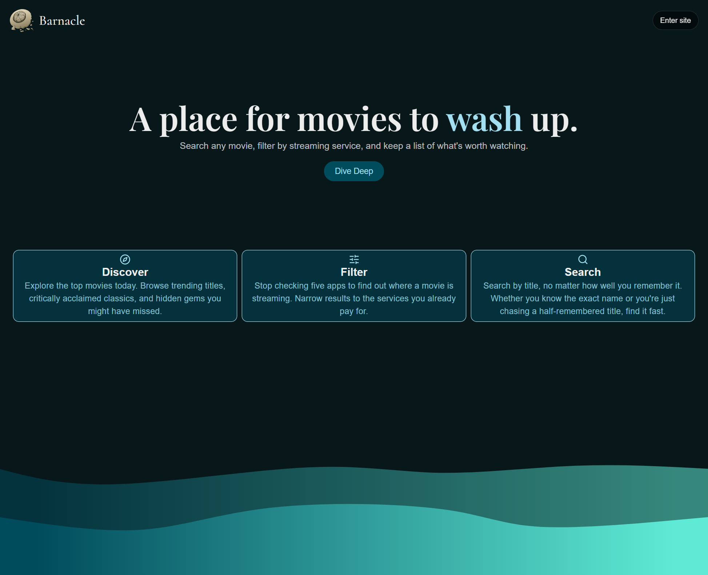

<a id="readme-top"></a>
[](https://nextjs.org/)
[](https://react.dev/)
[](https://www.typescriptlang.org/)
[](https://tailwindcss.com/)

# Barnacle



🔗 **Live app:** [barnacle-one.vercel.app](https://barnacle-one.vercel.app)

Barnacle is a movie discovery app that lets you search for movies and filter them by the streaming services you're actually subscribed to. You can easily pull up details like the cast, backdrops, and direct streaming links so you know exactly where to watch something before committing to it.

## Features

- Search for specific movies by title
- Browse with infinite scroll and filter by your streaming providers (Netflix, Max, Disney+, Hulu, etc.)
- View detailed movie pages featuring the cast, backdrops, streaming links, and recommended titles
- Create a profile and manage a personal watchlist (in progress)

## Getting Started

This project uses [pnpm](https://pnpm.io/) as its package manager.

### Prerequisites

- pnpm
  ```bash
  npm install -g pnpm@latest
  ```

### Installation

1. Get a free API key at [themoviedb.org](https://www.themoviedb.org/settings/api)
2. Clone the repo
   ```bash
   git clone https://github.com/Benjamin-Dekan/Barnacle.git
   ```
3. Install PNPM packages
   ```bash
   pnpm install
   ```
4. Create a `.env.local` file in the root directory and enter your API key as `TMDB_API_KEY`:
   ```bash
   TMDB_API_KEY=your_api_key_here
   ```
5. Run the development server: (Open [http://localhost:3000](http://localhost:3000) in your browser to see the app)
   ```bash
   pnpm dev
   ```

## Usage

#### Discover:


#### Search:


## License

Distributed under the MIT License. See LICENSE.txt for more information.

## Contact

Benjamin Dekan - [benjamindekan360@gmail.com](mailto:benjamindekan360@gmail.com) - [LinkedIn](https://www.linkedin.com/in/benjamin-dekan-b268783a9/)

Project Link: [github.com/Benjamin-Dekan/Barnacle](https://github.com/Benjamin-Dekan/Barnacle)

## Acknowledgements

This product uses the TMDb API but is not endorsed or certified by TMDb.


<p align="right">(<a href="#readme-top">back to top</a>)</p>
